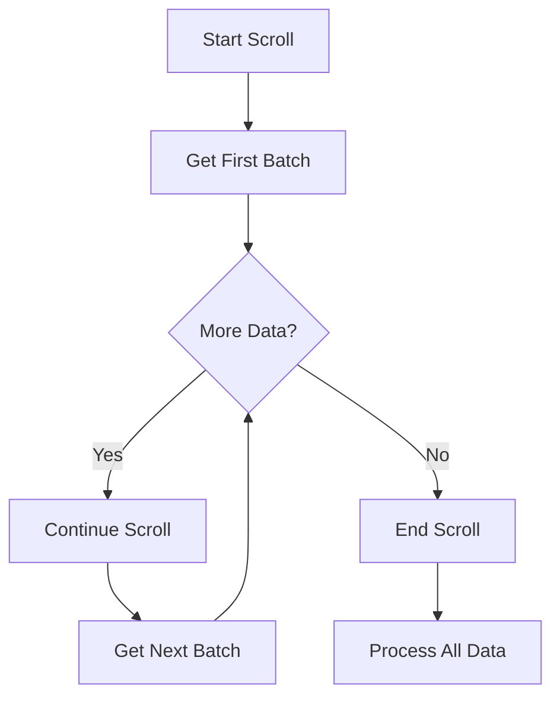
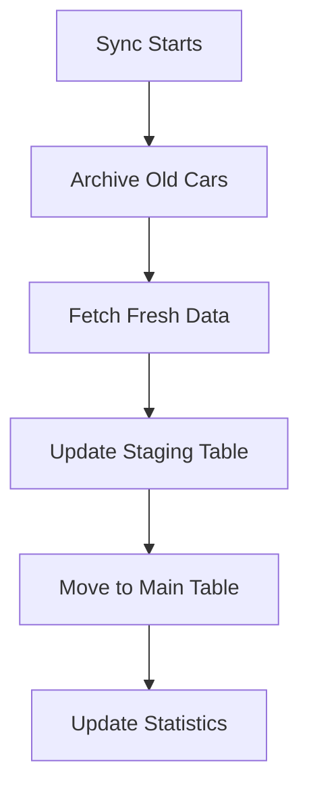

# Auctions API Integration Documentation

This document describes the integration of the new `api.auctionsapi.com` API into the KORAUTO application.

## Overview

The Auctions API provides access to car data using scroll-based pagination, optimized for batch processing of large datasets. This integration includes:

- **Scroll-based pagination** for efficient data fetching
- **Brand and model endpoints** for reference data
- **24-hour archiving logic** to keep data synchronized
- **Error handling and rate limiting** for robust operation
- **React hooks** for easy integration into components

## API Endpoints

### Cars API
- **Base URL**: `https://api.auctionsapi.com/cars`
- **Method**: GET
- **Features**: Scroll-based pagination, batch processing
- **Rate Limits**: 1 request per second, 30-second timeout

### Brands API
- **Base URL**: `https://api.auctionsapi.com/brands`
- **Method**: GET
- **Returns**: List of all available car brands

### Models API
- **Base URL**: `https://api.auctionsapi.com/models/{brand_id}`
- **Method**: GET
- **Returns**: Models for a specific brand with generations

## Implementation Files

### 1. Core Service (`src/services/auctionsApiService.ts`)

The main service class that handles all API interactions:

```typescript
import { AuctionsApiService } from '@/services/auctionsApiService';

const service = new AuctionsApiService({
  apiKey: 'your-api-key',
  scrollTime: 10, // minutes
  limit: 1000     // cars per batch
});

// Start scroll session
const response = await service.startCarsScroll();

// Continue scrolling
const nextResponse = await service.continueCarsScroll();

// Get all cars at once
const allCars = await service.fetchAllCars();
```

**Key Features:**
- Scroll session management
- Automatic error handling
- Rate limiting and retry logic
- TypeScript interfaces for all data structures

### 2. React Hooks

#### Direct API Hook (`src/hooks/useAuctionsApi.ts`)
Direct integration with the API service:

```typescript
import { useAuctionsApi } from '@/hooks/useAuctionsApi';

const {
  cars,
  isLoading,
  error,
  startScroll,
  continueScroll,
  fetchAllCars,
  brands,
  models,
  fetchBrands,
  fetchModels
} = useAuctionsApi({
  apiKey: 'your-api-key',
  autoStart: false,
  onError: (error) => console.error(error),
  onProgress: (total, batch) => console.log(`Fetched ${total} cars`)
});
```

#### Supabase Edge Function Hook (`src/hooks/useAuctionsApiSupabase.ts`)
Integration through Supabase edge functions:

```typescript
import { useAuctionsApiSupabase } from '@/hooks/useAuctionsApiSupabase';

const {
  cars,
  isLoading,
  startScroll,
  continueScroll,
  fetchAllCars,
  brands,
  models,
  fetchBrands,
  fetchModels
} = useAuctionsApiSupabase({
  autoStart: false,
  onError: (error) => console.error(error),
  onProgress: (total, batch) => console.log(`Fetched ${total} cars`)
});
```

### 3. Supabase Edge Function (`supabase/functions/auctions-api/index.ts`)

Secure proxy for the Auctions API with:
- API key management
- Request validation
- Error handling
- Rate limiting
- CORS support

**Usage:**
```typescript
// Start scroll session
const { data } = await supabase.functions.invoke('auctions-api', {
  body: {
    action: 'start',
    scroll_time: 10,
    limit: 1000
  }
});

// Continue scrolling
const { data } = await supabase.functions.invoke('auctions-api', {
  body: {
    action: 'continue',
    scroll_id: 'your-scroll-id'
  }
});

// Get brands
const { data } = await supabase.functions.invoke('auctions-api', {
  body: { action: 'brands' }
});

// Get models
const { data } = await supabase.functions.invoke('auctions-api', {
  body: {
    action: 'models',
    brand_id: 1
  }
});
```

### 4. Sync Script (`scripts/sync-auctions-cars.ts`)

Automated sync script with 24-hour archiving:

```bash
# Set environment variables
export SUPABASE_URL="your-supabase-url"
export SUPABASE_SERVICE_ROLE_KEY="your-service-role-key"
export AUCTIONS_API_KEY="your-auctions-api-key"

# Run sync
npx tsx scripts/sync-auctions-cars.ts
```

**Features:**
- Scroll-based data fetching
- 24-hour archiving logic
- Batch processing
- Progress tracking
- Error handling and retry logic

### 5. Demo Component (`src/components/AuctionsApiDemo.tsx`)

Interactive demo component showcasing all API features:

```typescript
import { AuctionsApiDemo } from '@/components/AuctionsApiDemo';

// Use in your app
<AuctionsApiDemo />
```

## Configuration

### Environment Variables

Add these to your environment configuration:

```bash
# Required for Supabase integration
SUPABASE_URL=your-supabase-url
SUPABASE_SERVICE_ROLE_KEY=your-service-role-key

# Required for Auctions API
AUCTIONS_API_KEY=your-auctions-api-key
```

### API Configuration

```typescript
const config = {
  apiKey: 'your-api-key',
  baseUrl: 'https://api.auctionsapi.com', // optional
  scrollTime: 10,  // minutes (max 15)
  limit: 1000      // cars per batch (max 2000)
};
```

## Data Flow

### 1. Scroll Pagination Workflow



### 2. 24-Hour Archiving Logic



## Error Handling

The integration includes comprehensive error handling for:

- **403 Errors**: Invalid API key, inactive subscription, IP not whitelisted
- **400 Errors**: Invalid parameters (scroll time, limit)
- **429 Errors**: Rate limiting with exponential backoff
- **Timeout Errors**: Request timeouts with retry logic
- **Network Errors**: Connection issues with retry logic

## Rate Limiting

- **API Requests**: 1 request per second
- **Retry Logic**: Exponential backoff (1s, 2s, 4s)
- **Max Retries**: 3 attempts
- **Timeout**: 30 seconds per request

## Data Synchronization

### 24-Hour Archiving

Cars not returned by the API in the last 24 hours are automatically archived:

```typescript
// Archive cars older than 24 hours
const cutoffTime = new Date();
cutoffTime.setHours(cutoffTime.getHours() - 24);

await supabase
  .from('cars_staging')
  .update({ is_archived: true })
  .lt('last_synced_at', cutoffTime.toISOString());
```

### Staging Table Structure

```sql
CREATE TABLE cars_staging (
  id TEXT PRIMARY KEY,
  brand TEXT,
  model TEXT,
  year INTEGER,
  source_api TEXT DEFAULT 'auctions_api',
  last_synced_at TIMESTAMP DEFAULT NOW(),
  is_archived BOOLEAN DEFAULT FALSE,
  archived_at TIMESTAMP
);
```

## Usage Examples

### Basic Car Fetching

```typescript
import { useAuctionsApiSupabase } from '@/hooks/useAuctionsApiSupabase';

function CarList() {
  const { cars, isLoading, startScroll, hasMoreData, continueScroll } = useAuctionsApiSupabase();
  
  return (
    <div>
      <button onClick={() => startScroll(10, 1000)} disabled={isLoading}>
        Load Cars
      </button>
      
      {hasMoreData && (
        <button onClick={continueScroll} disabled={isLoading}>
          Load More
        </button>
      )}
      
      {cars.map(car => (
        <div key={car.id}>
          {car.brand} {car.model} ({car.year})
        </div>
      ))}
    </div>
  );
}
```

### Brand and Model Selection

```typescript
import { useAuctionsApiSupabase } from '@/hooks/useAuctionsApiSupabase';

function BrandModelSelector() {
  const { brands, models, fetchBrands, fetchModels, isLoadingBrands, isLoadingModels } = useAuctionsApiSupabase();
  
  useEffect(() => {
    fetchBrands();
  }, []);
  
  return (
    <div>
      <select onChange={(e) => fetchModels(Number(e.target.value))}>
        <option>Select Brand</option>
        {brands.map(brand => (
          <option key={brand.id} value={brand.id}>
            {brand.name}
          </option>
        ))}
      </select>
      
      <select disabled={isLoadingModels}>
        <option>Select Model</option>
        {models.map(model => (
          <option key={model.id} value={model.id}>
            {model.name}
          </option>
        ))}
      </select>
    </div>
  );
}
```

## Testing

### Manual Testing

Use the demo component to test all features:

```typescript
import { AuctionsApiDemo } from '@/components/AuctionsApiDemo';

// Add to your app for testing
<AuctionsApiDemo />
```

### Automated Testing

Run the sync script to test data synchronization:

```bash
# Test sync with small batch
npx tsx scripts/sync-auctions-cars.ts
```

## Troubleshooting

### Common Issues

1. **403 Forbidden**: Check API key and subscription status
2. **Rate Limiting**: Reduce request frequency or increase delays
3. **Timeout Errors**: Check network connection and API status
4. **Scroll Session Expired**: Restart scroll session

### Debug Mode

Enable debug logging:

```typescript
const service = new AuctionsApiService({
  apiKey: 'your-key',
  debug: true // Enable debug logging
});
```

## Performance Considerations

- **Batch Size**: Use 1000-2000 cars per batch for optimal performance
- **Scroll Time**: 10-15 minutes for scroll sessions
- **Memory Usage**: Process large datasets in batches
- **Network**: Implement proper error handling and retry logic

## Security

- API keys are stored securely in environment variables
- Supabase edge functions provide secure API key management
- CORS headers are properly configured
- Request validation prevents injection attacks

## Future Enhancements

- [ ] Real-time data updates via WebSocket
- [ ] Advanced filtering and search capabilities
- [ ] Data caching and optimization
- [ ] Analytics and monitoring dashboard
- [ ] Automated sync scheduling

## Support

For issues or questions regarding the Auctions API integration:

1. Check the error logs in the browser console
2. Verify environment variables are correctly set
3. Test API connectivity using the demo component
4. Review the sync script logs for data synchronization issues

---

*Last updated: December 2024*
